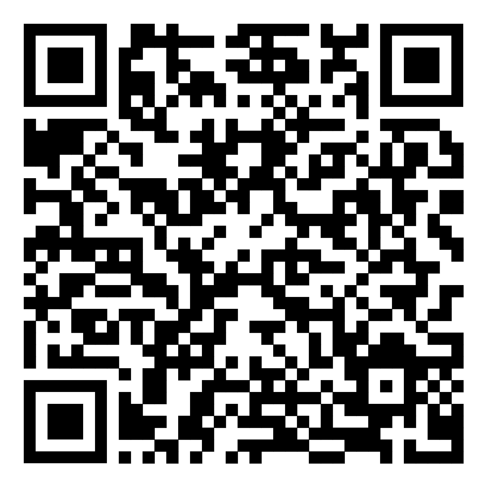

# Šachy – SOČ projekt  
Autor: **Alexandr Jordán**

Studentská práce pro soutěž **Středoškolská odborná činnost (SOČ)**.  
Tento veřejný repozitář obsahuje _aktuální_ zdrojový kód aplikace (bez kompletní historie).

---

## Klonování repozitáře
```bash
git clone https://github.com/alexandrjordan/ChessPublic.git
cd ChessPublic
```
## Požadavky
Android Studio – doporučeno vydání Flamingo (2022.2.1) nebo novější
Start → File ▸ Open → vyberte kořenovou složku projektu.

Bez diakritiky v cestě k projektu – kvůli Gradle a Android SDK.

## Stažení a spuštění aplikace
Aktualní verzi aplikaci naleznete na Google Play:

<https://play.google.com/store/apps/details?id=com.jordan.chess>

a nebo na tomto QR kódu:

<a href="https://play.google.com/store/apps/details?id=com.jordan.chess">
  
</a>


## Řešení problémů
Unable to delete directory při buildu:	Smazat složku Chess/app/build a projekt znovu sestavit.

## Karballo Chess Engine
Tento projekt využívá Karballo Chess Engine od Alberto Alonso Ruibal, který je licencován pod MIT licencí.

Licenční ujednání (MIT License):
```
Copyright (c) 2017 Alberto Alonso Ruibal

Permission is hereby granted, free of charge, to any person obtaining a copy
of this software and associated documentation files (the "Software"), to deal
in the Software without restriction, including without limitation the rights
to use, copy, modify, merge, publish, distribute, sublicense, and/or sell
copies of the Software, and to permit persons to whom the Software is
furnished to do so, subject to the following conditions:

The above copyright notice and this permission notice shall be included in all
copies or substantial portions of the Software.

THE SOFTWARE IS PROVIDED "AS IS", WITHOUT WARRANTY OF ANY KIND, EXPRESS OR
IMPLIED, INCLUDING BUT NOT LIMITED TO THE WARRANTIES OF MERCHANTABILITY,
FITNESS FOR A PARTICULAR PURPOSE AND NONINFRINGEMENT. IN NO EVENT SHALL THE
AUTHORS OR COPYRIGHT HOLDERS BE LIABLE FOR ANY CLAIM, DAMAGES OR OTHER
LIABILITY, WHETHER IN AN ACTION OF CONTRACT, TORT OR OTHERWISE, ARISING FROM,
OUT OF OR IN CONNECTION WITH THE SOFTWARE OR THE USE OR OTHER DEALINGS IN THE
SOFTWARE.
```
